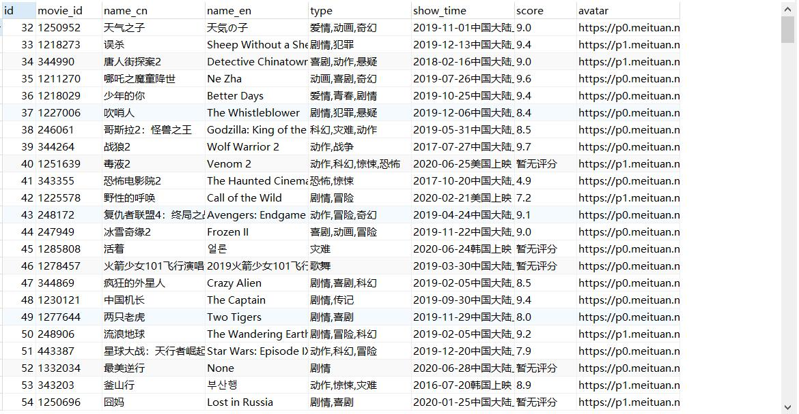

# week02 学习笔记

本周主要学习了反爬虫的几种方式以及在 scrapy 里设置中间件的方法.

## scrapy

- 编写中间件(Middleware)/扩展(Extensions)时，[raise NotConfigutation 的作用](https://docs.scrapy.org/en/latest/topics/extensions.html#topics-extensions)是: 如果抛出了 `NotConfigured` 异常, 则表示关闭对应的中间件或扩展
- 中间件修改代理 IP: `request.meta['proxy'] = <proxy:str>`(重写 `process_request` 方法)
- 中间件修改 `User-Agent`: `request.headers['User-Agent'] = <user_agent>`(重写 `process_request` 方法)
- 中间件都是一个类, 自定义只需要实现特定的方法, scrapy 启动后会通过 import 操作来使用中间件/扩展，因此中间件/扩展放在任意可导入的路径下, 以便在多个 scrapy 项目中复用

## 作业

- 代理 IP 使用的是 [芝麻代理](http://h.zhimaruanjian.com/)免费版, 每天签到可以领取少量 IP.
- 数据存储从 csv 改为 MySQL

作业 1 结果如下:

作业 2 requests 版结果如下:

作业 2 selenium 版结果如下:

