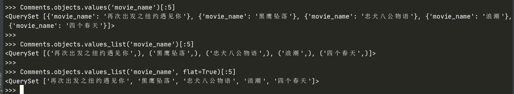

- [django](#django)
- [官方文档](#官方文档)
- [安装](#安装)
- [查看版本](#查看版本)
- [项目结构](#项目结构)
- [根配置文件 settings.py](#根配置文件-settingspy)
- [URL 调度器 urls.py](#url-调度器-urlspy)
- [模型层 models.py](#模型层-modelspy)
  - [查询](#查询)
    - [Django values_list vs values](#django-values_list-vs-values)
  - [根据已有数据表反向生成 ORM](#根据已有数据表反向生成-orm)
    - [MySQL](#mysql)
      - [常见报错](#常见报错)
        - [No module named 'MySQLdb'](#no-module-named-mysqldb)
        - [mysqlclient 1.3.13 or newer is required](#mysqlclient-1313-or-newer-is-required)
        - [AttributeError: 'str' object has no attribute 'decode'](#attributeerror-str-object-has-no-attribute-decode)
- [视图层 view.py](#视图层-viewpy)
- [模板 template](#模板-template)
- [作业](#作业)


# django


# 官方文档


- django 官方文档: [https://docs.djangoproject.com/zh-hans/3.0/](https://docs.djangoproject.com/zh-hans/3.0/)
- django-admin 和 manage.py 使用: [https://docs.djangoproject.com/zh-hans/3.0/ref/django-admin/](https://docs.djangoproject.com/zh-hans/3.0/ref/django-admin/)


# 安装

<br />安装最新版本:<br />

```bash
pip install Django
pip install Django==2.2
```


# 查看版本


```bash
$ django-admin version
3.0.8
```


```bash
$ python -c "import django; print(django.__version__)"
3.0.8
```


```bash
$ python -c "import django; print(django.get_version())"
3.0.8
```


# 项目结构


- startproject 创建的项目目录结构说明: [https://docs.djangoproject.com/zh-hans/3.0/intro/tutorial01/#creating-a-project](https://docs.djangoproject.com/zh-hans/3.0/intro/tutorial01/#creating-a-project)


# 根配置文件 settings.py


- 配置字段说明: [https://docs.djangoproject.com/zh-hans/3.0/ref/settings/](https://docs.djangoproject.com/zh-hans/3.0/ref/settings/)


# URL 调度器 urls.py


- URL 调度器: [https://docs.djangoproject.com/zh-hans/3.0/topics/http/urls/](https://docs.djangoproject.com/zh-hans/3.0/topics/http/urls/)


# 模型层 models.py


- 基本介绍: [https://docs.djangoproject.com/zh-hans/3.0/topics/db/models/](https://docs.djangoproject.com/zh-hans/3.0/topics/db/models/)
- 模型字段: [https://docs.djangoproject.com/zh-hans/3.0/ref/models/fields/](https://docs.djangoproject.com/zh-hans/3.0/ref/models/fields/)
- 查询功能: [https://docs.djangoproject.com/zh-hans/3.0/topics/db/queries/](https://docs.djangoproject.com/zh-hans/3.0/topics/db/queries/)
- 聚合功能: [https://docs.djangoproject.com/zh-hans/3.0/topics/db/aggregation/](https://docs.djangoproject.com/zh-hans/3.0/topics/db/aggregation/)
- 搜索功能: [https://docs.djangoproject.com/zh-hans/3.0/topics/db/search/](https://docs.djangoproject.com/zh-hans/3.0/topics/db/search/)
- 使用原生 SQL 语句: [https://docs.djangoproject.com/zh-hans/3.0/topics/db/sql/](https://docs.djangoproject.com/zh-hans/3.0/topics/db/sql/)
- Meta 选项: [https://docs.djangoproject.com/zh-hans/3.0/ref/models/options/](https://docs.djangoproject.com/zh-hans/3.0/ref/models/options/)
- 模型管理器 Manager: [https://docs.djangoproject.com/zh-hans/3.0/topics/db/managers/](https://docs.djangoproject.com/zh-hans/3.0/topics/db/managers/)
- 多数据库配置: [https://docs.djangoproject.com/zh-hans/3.0/topics/db/multi-db/](https://docs.djangoproject.com/zh-hans/3.0/topics/db/multi-db/)
- 根据已有数据表反向生成 ORM: [https://docs.djangoproject.com/zh-hans/3.0/ref/django-admin/#inspectdb](https://docs.djangoproject.com/zh-hans/3.0/ref/django-admin/#inspectdb)


## 查询


### [Django values_list vs values](https://stackoverflow.com/questions/37205793/django-values-list-vs-values)




## 根据已有数据表反向生成 ORM


### MySQL


```python
# settings.py
# Database
# https://docs.djangoproject.com/en/2.2/ref/settings/#databases
# 数据库配置，默认是sqlite，Django2.2 使用 mysqlclient 或 pymysql 模块连接 MySQL
# DATABASES = {
#     'default': {
#         'ENGINE': 'django.db.backends.sqlite3',
#         'NAME': os.path.join(BASE_DIR, 'db.sqlite3'),
#     }
# }

# export PATH=$PATH:/usr/local/mysql/bin
# OSError: mysql_config not found
# pip install mysqlclient
# pip install pymysql
DATABASES = {
    'default': {
        'ENGINE': 'django.db.backends.mysql',
        'USER': 'root',
        'PASSWORD': 'xxx',
        'HOST': '127.0.0.1',
        'PORT': '3306',
        'NAME': 'db2',  # 数据库名字
    }
    # 生产环境有可能连接第二个数据库
    # 'db2': {
    #     'ENGINE': 'django.db.backends.mysql',
    #     'NAME': 'mydatabase',
    #     'USER': 'mydatabaseuser',
    #     'PASSWORD': 'mypassword',
    #     'HOST': '127.0.0.1',
    #     'PORT': '3307',
    # }
}
```


#### 常见报错


##### No module named 'MySQLdb'


```
Watching for file changes with StatReloader
Exception in thread django-main-thread:
Traceback (most recent call last):
  File "xxx\site-packages\django\db\backends\mysql\base.py", line 16, in <module>
    import MySQLdb as Database
ModuleNotFoundError: No module named 'MySQLdb'

The above exception was the direct cause of the following exception:

Traceback (most recent call last):
  ......
  raise ImproperlyConfigured(
django.core.exceptions.ImproperlyConfigured: Error loading MySQLdb module.
Did you install mysqlclient?
```

<br />解决方法:<br />

```python
# 与 settings.py 同级的 __init__.py
# pip install pymysql
import pymysql
pymysql.install_as_MySQLdb()
```


##### mysqlclient 1.3.13 or newer is required


> 较新版本的 django 不会有这个问题


<br />解决方法:<br />

```python
# 找到相应的文件, 注释下面版本检测语句
# if version < (1, 3, 13):
# raise ImproperlyConfigured('mysqlclient 1.3.13 or newer is required; you have %s.' % Database.__version__)
```


##### AttributeError: 'str' object has no attribute 'decode'

<br />解决方法:<br />

```python
# 出现这个错误之后可以根据错误提示找到文件位置，打开 operations.py 文件，找到以下代码并注释：
def last_executed_query(self, cursor, sql, params):
    query = getattr(cursor, '_executed', None)
    # 注释下面两行
    # if query is not None:
    #     query = query.decode(errors='replace')
    return query
```


# 视图层 view.py


- 编写视图: [https://docs.djangoproject.com/zh-hans/3.0/topics/http/views/](https://docs.djangoproject.com/zh-hans/3.0/topics/http/views/)
- 视图装饰器: [https://docs.djangoproject.com/zh-hans/3.0/topics/http/decorators/](https://docs.djangoproject.com/zh-hans/3.0/topics/http/decorators/)
- 快捷函数: [https://docs.djangoproject.com/zh-hans/3.0/topics/http/shortcuts/](https://docs.djangoproject.com/zh-hans/3.0/topics/http/shortcuts/)
- 通用视图 API: [https://docs.djangoproject.com/zh-hans/3.0/ref/class-based-views/](https://docs.djangoproject.com/zh-hans/3.0/ref/class-based-views/)


# 模板 template


- 模板介绍: [https://docs.djangoproject.com/zh-hans/3.0/topics/templates/](https://docs.djangoproject.com/zh-hans/3.0/topics/templates/)
- 模板语法: [https://docs.djangoproject.com/zh-hans/3.0/topics/templates/#the-django-template-language](https://docs.djangoproject.com/zh-hans/3.0/topics/templates/#the-django-template-language)
- 模板标签和过滤器: [https://docs.djangoproject.com/zh-hans/3.0/ref/templates/builtins/](https://docs.djangoproject.com/zh-hans/3.0/ref/templates/builtins/)
- Vue.js In A Django Template: [https://vsupalov.com/vue-js-in-django-template/](https://vsupalov.com/vue-js-in-django-template/)


<br />


# 作业

