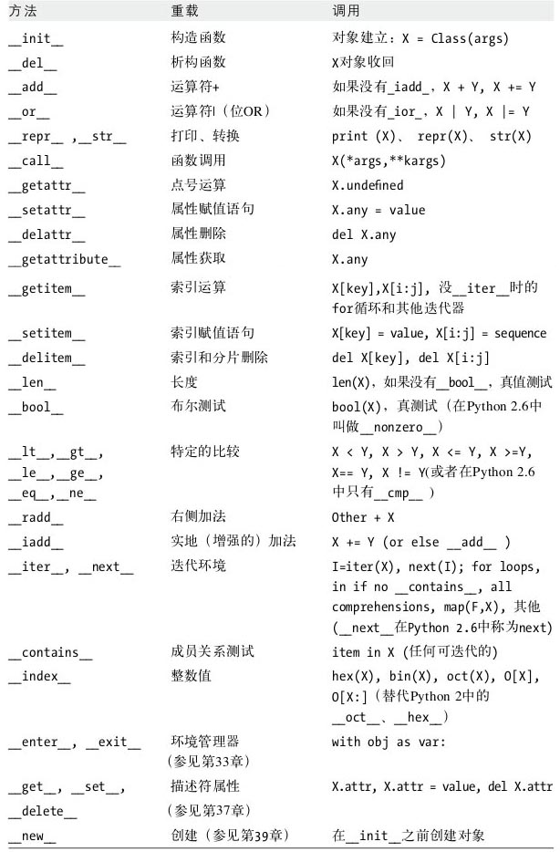
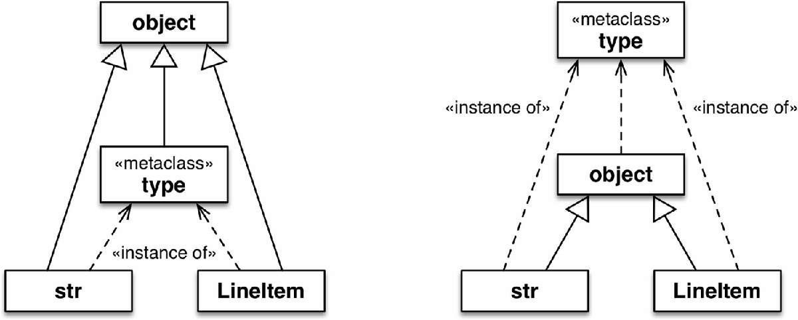

# 魔术方法

我们常说的 python 的魔术方法是一类具有特殊名称的方法, 用于实现由特殊语法所引发的特定操作, 如索引, 切片


> 上图摘自《Python学习手册》

参考: https://docs.python.org/zh-cn/3/reference/datamodel.html#special-method-names


# 新式类 (New-style classes) vs 旧式类/经典类 (Old-style classes)

- 新式类最初的版本是 python 2.3, 也从这个版本开始, 旧式类被移除
- 在 python2.2 及以前版本里, 如果需要使用新式类, 需要显式继承 object, 在 python2.3 及以后的版本里, 所有的类最终都继承自 object, 显式继承 object 是可选的
- 在多继承中属性/方法的查找顺序: 新式类使用 c3 算法(广度优先), 我们可以使用有向无环图或者菱形继承或者 `__mro__` 判断; 旧式类深度优先, 参考: https://www.python.org/download/releases/2.3/mro/


# object 与 type

- object 是所有类的基类
- type 的父类是 object, object 没有父类, type 和 object 不是继承关系
- object 是 type 的实例, 而 type 是 object 的子类, 这种关系很“神奇”, 无法使用Python代码表述
- type 和 object 都是由 type 创建
- 除了 type, 标准库中还有一些别的元类, 例如 `abc.ABCMeta` 和 `Enum`


> 上图摘自《流畅的python》

# [super](https://docs.python.org/zh-cn/3/library/functions.html?highlight=object#super)

```python
super([type[, object-or-type]])
```

- 调用父类的方法
- 使用方法
    - 单继承: 可以不必显式地指定它们的名称, 从而令代码更易维护
    - 多继承: 搜索顺序为 `<object-or-type>.__mro__`
- 参考: https://rhettinger.wordpress.com/2011/05/26/super-considered-super/

# 作业

输出结果如下：

```python
实例化 Animal 类出错: Can't instantiate abstract class Animal with abstract methods __init__
动物园是否有猫这种动物: False
动物园是否有狗这种动物: False

现在往动物园里添加动物：
添加 <Cat, 短毛猫, 小, 温顺>: 成功
添加 <Cat, 短毛猫, 小, 凶猛>: 成功
添加 <Cat, 加菲猫, 中, 温顺>: 成功
添加 <Cat, 加菲猫, 中, 凶猛(凶猛动物)>: 成功
添加 <Cat, 波斯猫, 大, 温顺>: 成功
添加 <Cat, 波斯猫, 大, 凶猛(凶猛动物)>: 成功
添加 <Cat, 波斯猫, 大, 凶猛>: 成功

现在往动物园里重复添加动物：
添加 <Cat, 短毛猫, 小, 温顺>: 失败
添加 <Cat, 短毛猫, 小, 凶猛>: 失败
添加 <Cat, 加菲猫, 中, 温顺>: 失败
添加 <Cat, 加菲猫, 中, 凶猛(凶猛动物)>: 失败
添加 <Cat, 波斯猫, 大, 温顺>: 失败
添加 <Cat, 波斯猫, 大, 凶猛(凶猛动物)>: 失败
添加 <Cat, 波斯猫, 大, 凶猛>: 失败

动物园是否有猫这种动物: True
动物园是否有狗这种动物: False
```