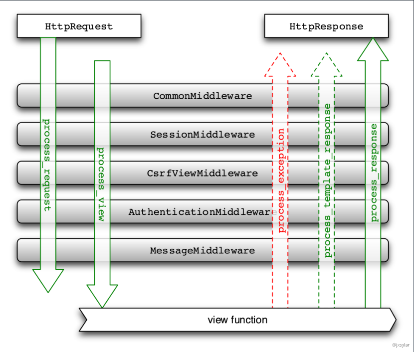
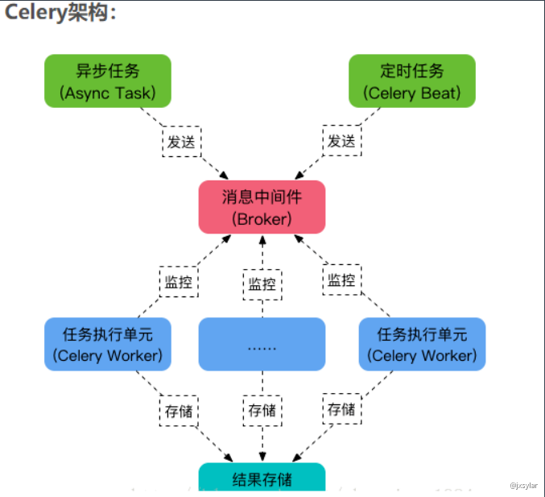

- [中间件 middleware](#中间件-middleware)
- [表单 Form](#表单-form)
- [CSRF 防护](#csrf-防护)
- [信号 Signals](#信号-signals)
- [部署 Deploy](#部署-deploy)
- [分布式消息队列 Celery](#分布式消息队列-celery)
- [作业](#作业)


# 中间件 middleware


- 中间件: [https://docs.djangoproject.com/zh-hans/3.0/topics/http/middleware/](https://docs.djangoproject.com/zh-hans/3.0/topics/http/middleware/)





# 表单 Form


- 表单: [https://docs.djangoproject.com/zh-hans/3.1/topics/forms/](https://docs.djangoproject.com/zh-hans/3.1/topics/forms/)
- 表单控件: [https://docs.djangoproject.com/zh-hans/3.1/ref/forms/widgets/](https://docs.djangoproject.com/zh-hans/3.1/ref/forms/widgets/)


# CSRF 防护


- Cross Site Request Forgery protection: [https://docs.djangoproject.com/zh-hans/3.0/ref/csrf/](https://docs.djangoproject.com/zh-hans/3.0/ref/csrf/)  (里面说明了在 Ajax 请求如何使用 csrf 防护)


# 信号 Signals 


- 信号: [https://docs.djangoproject.com/zh-hans/3.1/ref/signals/](https://docs.djangoproject.com/zh-hans/3.1/ref/signals/)


# 部署 Deploy


- 部署 Django: [https://docs.djangoproject.com/zh-hans/3.1/howto/deployment/](https://docs.djangoproject.com/zh-hans/3.1/howto/deployment/)
- 如何使用 Gunicorn 托管 Django: [https://docs.djangoproject.com/zh-hans/3.1/howto/deployment/wsgi/gunicorn/](https://docs.djangoproject.com/zh-hans/3.1/howto/deployment/wsgi/gunicorn/)
- How to use Django with Uvicorn: [https://docs.djangoproject.com/zh-hans/3.1/howto/deployment/asgi/uvicorn/](https://docs.djangoproject.com/zh-hans/3.1/howto/deployment/asgi/uvicorn/)


gunicorn 不支持 windows 平台, 如果在 windows 上使用会报错:

```python
ModuleNotFoundError: No module named 'fcntl'
```

在 Windows 可以使用 uvicorn:

```bash
# 在 manage.py 目录下, 运行
# uvicorn <project_name>.asgi:application
# 这里的 application 是 `application = get_asgi_application()` 的 application
$ uvicorn myproject.asgi:application
```

gunicorn 的用法类似:

```shell
# 在 manage.py 目录下, 运行
# gunicorn <project_name>.wsgi
# 这里的 wsgi 是 <project_name> 目录里的 `wsgi.py` 这个文件
$ gunicorn myproject.wsgi
```

uvicorn 使用的是 asgi, gunicorn 使用的是 asgi

# 分布式消息队列 Celery


- 使用 celery 实现定时任务
- Using Celery with Django: [https://docs.celeryproject.org/en/latest/django/first-steps-with-django.html](https://docs.celeryproject.org/en/latest/django/first-steps-with-django.html)





# 作业

